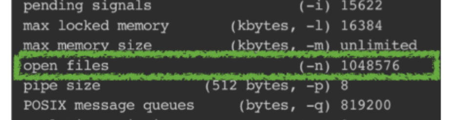
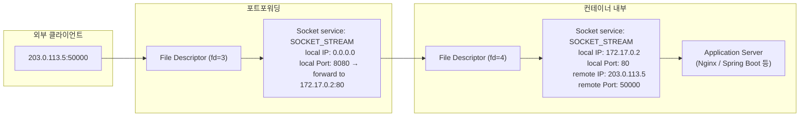

# Socket 통신

## 1. Scoket이란?
- 애플리케이션 레벨(유저 모드)에서 OS(커널)에 접근할 수 있도록 프로토콜을 추상화한 인터페이스
    - 리눅스 시스템에서 파일(file)처럼 다뤄지며(메모리상 자료구조), 파일 디스크립터(File Descriptor)를 통해 관리
    - 개발자는 소켓을 열고, 특정 주소에 연결하고, 데이터를 쓰고 읽는 방식으로 네트워크 프로그래밍을 할 수 있음.
> 소켓은 '파일'이 아니지만, OS가 '파일처럼' 다룰 수 있게 해주는 '파일 디스크립터'를 통해 접근하는 통신 객체
> - 파일 디스크립터 (File Descriptor): 운영체제(OS)가 자신이 관리하는 파일이나 입출력 자원(소켓, 파이프 등)에 붙이는 고유한 번호표(정수 값). 프로그램은 이 번호표를 통해 특정 파일이나 소켓에 접근하여 데이터를 읽거나 쓸 수 있음.

## 2. 소켓 구성
- Protocol:  TCP, UDP
- Local IP: 내 컴퓨터의 IP 주소
- Local Port: 내 컴퓨터에서 실행 중인 프로세스의 포트
- Remote IP: 통신 상대방 컴퓨터의 IP 주소
- Remote Port: 상대방 프로세스의 포트
> port: 포트는 컴퓨터 네트워킹에서 특정 응용 프로그램이나 서비스를 식별하는 데 사용되는 논리적인 통신 종점.

#### local port
- 서버의 경우, 클라이언트가 쉽게 찾아올 수 있도록 HTTP(80)처럼 약속된 Well-Known Port를 명시적으로 bind()하여 사용
- 클라이언트의 경우, OS가 자동으로 비어있는 임시 포트를 할당

#### remote port
- 서버 입장에서 remote port는 접속을 요청한 클라이언트의 임시 포트.
- 서버는 자신의 단일 포트(예: 443)만으로도 수많은 클라이언트로부터의 연결을 각각 고유하게 식별하고 동시에 통신을 처리할 수 있음.
```
 클라이언트 A -> 서버: 11.22.33.44:51000 -> 100.200.1.1:443
 클라이언트 B -> 서버: 55.66.77.88:62001 -> 100.200.1.1:443
 같은 클라이언트, 다른 탭: 11.22.33.44:51001 -> 100.200.1.1:443

서버는 100.200.1.1:443 이라는 동일한 로컬 소켓 정보를 가지지만, remote ip와 remote port의 조합이 모두 다르므로 각각을 별개의 연결로 식별하고 처리할 수 있슴.
```
> - 프로세스 별로 생성할 수 있는 소켓 갯수가 제한됨
> 


## 3. 소켓 종류 및 상태
주로 2가지 전송 프로토콜(TPC, UDP)에서 동작

`스트림 소켓 (Stream Socket, SOCK_STREAM)`: 
- TCP에서 사용. 
- 신뢰성 있는 연결 지향형 통신. 
- 데이터의 경계가 없고 바이트 스트림으로 전송

`데이터그램 소켓 (Datagram Socket, SOCK_DGRAM)`: 
- UDP에서 사용. 비연결형 통신. 
- 신뢰성을 보장하지 않지만 속도가 빠름.
- 데이터가 독립적인 패킷(데이터그램) 단위로 전송.

**상태**
- `ESTABLISHED`: 연결이 설정된 상태
- `TIME_WAIT`: 연결 종료 후 대기 상태
- `CLOSE_WAIT`: 상대방의 연결 종료 대기
- `LISTENING`: 연결 요청 대기 중


## 4. 소켓 통신의 흐름

#### 클라이언트
1. `socket` - 소켓 생성:
    서버에 연결할 소켓을 만듦.

2. `connect` - 연결 요청:
    서버의 IP 주소와 포트 번호(전화번호)를 가지고 연결을 시도합니다. 서버에서 accept가 성공하면 연결이 수립.

3. `write` / `read`  - 데이터 송수신:
    연결된 소켓을 통해 서버와 데이터를 주고받음

4. `close` - 연결 종료:
    통신이 끝나면 소켓을 닫음.

### 서버
1. `socket` - 소켓 생성:
통신을 위한 소켓을 만듦.
2. `bind` - 주소 할당:
    생성된 소켓에 IP 주소와 포트 번호를 부여.
3. `listen` - 연결 대기 상태로 전환:
    클라이언트의 연결 요청을 받을 준비. 이때 '연결 요청 대기 큐(Backlog)'의 크기를 설정 가능
4. `accept` - 연결 수락:
    실제 클라이언트의 연결 요청이 오면, 이를 수락하고 클라이언트와 통신할 새로운 소켓을 만듭니다. 기존의 listen 소켓은 다른 클라이언트의 연결을 계속 기다리고, 실제 데이터 통신은 이 새로운 소켓을 통해 이루어짐
5. `read` / `write`- 데이터 송수신:
    accept로 생성된 새 소켓을 통해 클라이언트와 데이터를 주고받음
6. `close` - 연결 종료:
    통신이 끝나면 소켓을 닫음
```java

//socket, bind, listen - ServerSocket 생성으로 모든 과정이 한번에 처리됨
try (ServerSocket serverSocket = new ServerSocket(port)) {
    while (true) {
           try (Socket clientSocket = serverSocket.accept();
                BufferedReader reader = new BufferedReader(new InputStreamReader(clientSocket.getInputStream()));
                PrintWriter writer = new PrintWriter(clientSocket.getOutputStream(), true)
                 ) {
            
            // 실제 통신 로직
            String message = reader.readLine();
            writer.println("Echo: " + message);
        }
    }

// try-with-resources로 자동 close 처리
} catch (IOException e) {
    e.printStackTrace();
}

```

## 참고: 포트 포워딩(Port fowarding)
외부 네트워크에서 특정 포트로 들어오는 요청을 내부 내트워크의 특정 장치로 전달하는 기능
- 내부 네트워크에 있는 서비스를 외부 인터넷 망에 노출시켜야 할 때 사용

